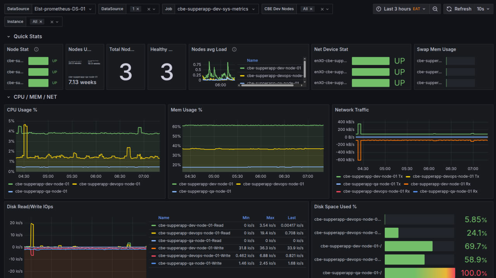
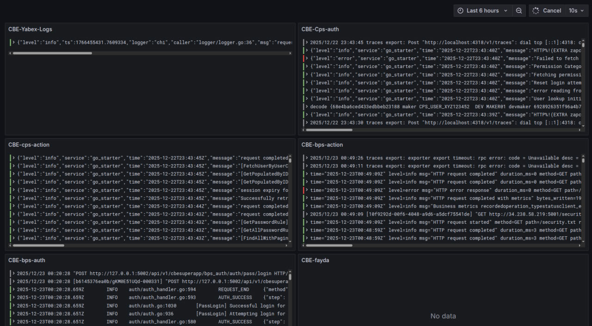

# Monitoring Stack Deployment

This repository contains the deployment configurations for a comprehensive monitoring stack, including Prometheus, Grafana, Loki, and other related components.

## Overview

The monitoring stack is designed to provide observability for your infrastructure and applications. It includes:

- **Prometheus**: For metrics collection and alerting.
- **Grafana**: For visualization and dashboards.
- **Loki**: For log aggregation.
- **Exporters**: Various exporters for collecting metrics from different sources (Node, MongoDB, Postgres, etc.).
- **Other Components**: Cert Manager, Ingress Nginx, MetalLB, etc.

## Prerequisites

- Kubernetes Cluster
- `kubectl` installed and configured
- `helm` installed

## Deployment

### Prometheus

To deploy Prometheus using the provided Helm chart and values:

1.  **Add the Prometheus Community Helm Repo:**

    ```bash
    helm repo add prometheus-community https://prometheus-community.github.io/helm-charts
    helm repo update
    ```

2.  **Install Prometheus:**

    Navigate to the `prometheus-deployment` directory and run:

    ```bash
    helm install elst-prometheus prometheus-community/prometheus -n elst-monitoring --values prometheusValues.yml
    ```

    *Note: Ensure the `elst-monitoring` namespace exists or add `--create-namespace`.*

### Other Components

Each component has its own deployment directory. Please refer to the specific directories for their configurations:

- `grafana-deployment`
- `loki_deplyoment`
- `ingress-nginx-deployment`
- ...and others.

## Visuals

Here are some previews of the monitoring dashboards:

### Resource Monitoring


### Log Monitoring


### VPN Monitoring

